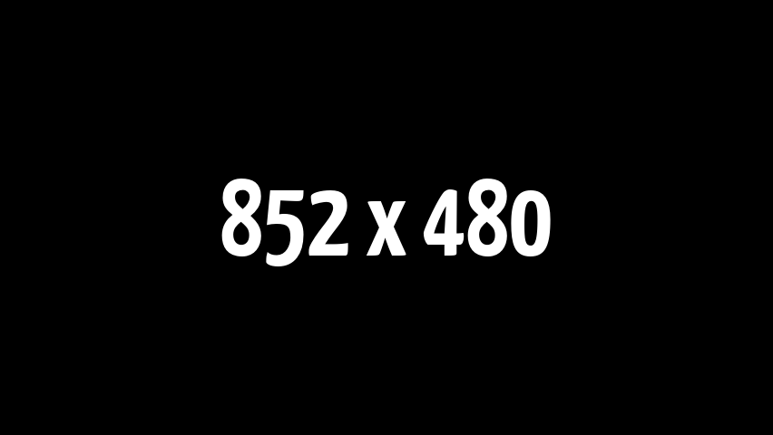

# <samp>MACHOGEN</samp>

Opinionated configuration script for macOS 12.

## <samp>OVERVIEW</samp>



## <samp>GUIDANCE</samp>

Running this blindly is strongly discouraged.

```shell
/bin/zsh -c "$(curl -fsSL https://raw.githubusercontent.com/sharpordie/machogen/HEAD/src/essential.sh)"
```
