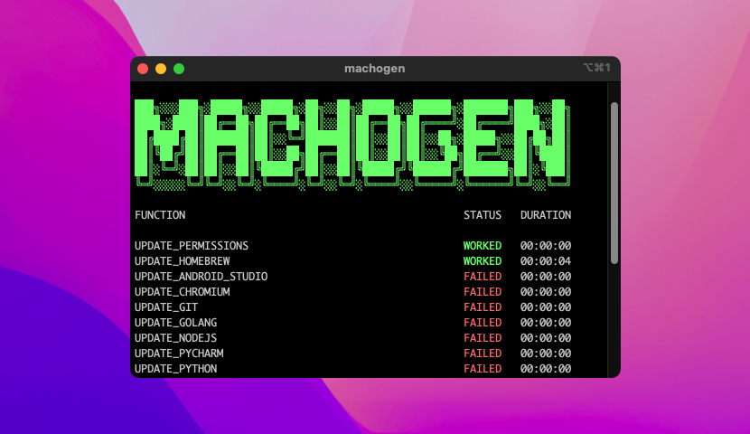

<div><hr>
<a href="../.."></a>
<h1>MACHOGEN</h1>
<p>Configuration Script for macOS</p>
<hr></div>

## <samp>OVERVIEW</samp>

Opinionated configuration script for macOS 12.

## <samp>FUNDINGS</samp>

<a href="../.." target="_blank"></a><a href="../.." target="_blank"></a>

## <samp>IGNITION</samp>

```shell
/bin/zsh -c "$(curl -fsSL https://raw.githubusercontent.com/sharpordie/machogen/HEAD/essential.sh)"
```

## <samp>PICTURES</samp>

<a href="assets/img1.png"></a><a href="assets/img1.png"></a>
