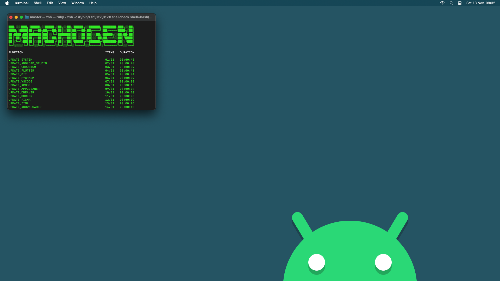

# MACHOGEN

Personal post-installation script for macOS 12.

<!--
## PREVIEW
## INFLAME
## SPARKLE
## RESOLVE
## RELEASE
## GALLERY
## RESULTS
## MISSION
## GENESIS
## ACQUIRE
## PUBLISH
## RELATED
## HISTORY
## VARIETY
-->

## SPARKLE

```shell
/bin/zsh -c "$(curl -fsSL https://raw.githubusercontent.com/sharpordie/machogen/HEAD/essential.sh)"
```

## RELATED

- [shihogen](https)  
  Configuration Script for Shield
- [ubuhogen](https)  
  Configuration Script for Ubuntu
- [winhogen](https)  
  Configuration Script for Windows

## GALLERY

<a href="assets/img1.png"></a><a></a><a href="assets/img1.png"></a>
