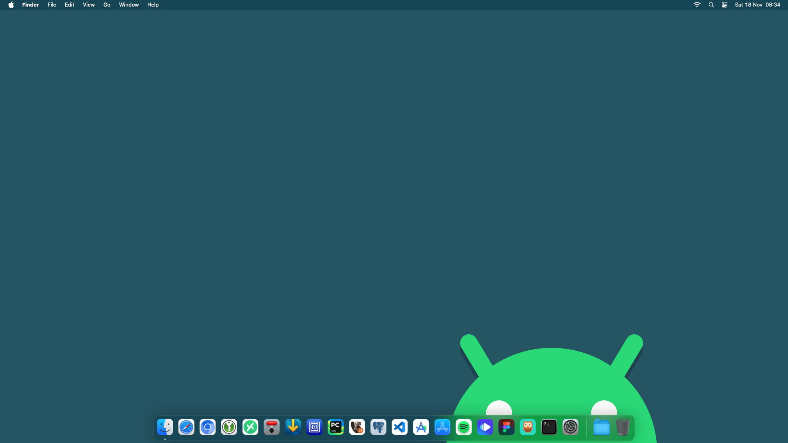

# <samp>OVERVIEW</samp>

Opinionated post-installation script for macOS 13.



# <samp>GUIDANCE</samp>

Blindly executing this is strongly discouraged.

```shell
/bin/zsh -c "$(curl -fsSL https://raw.githubusercontent.com/sharpordie/machogen/HEAD/src/machogen.sh)"
```

# <samp>DONATION</samp>

Support my work by sending me some crypto.

```txt
ADA: xxxxxxxxxxxxxxxxxxxxxxxxxxxxxxxxxxxxxxxxxxxxxxxxxxxxxxxxxxxxxxxxxxxxxxxxxxxxxxxxxxxxxxxxxxxxxxxxxxxxxxx
BCH: xxxxxxxxxxxxxxxxxxxxxxxxxxxxxxxxxxxxxxxxxx
BTC: xxxxxxxxxxxxxxxxxxxxxxxxxxxxxxxxxxxxxxxxxx
ETH: xxxxxxxxxxxxxxxxxxxxxxxxxxxxxxxxxxxxxxxxxx
XMR: xxxxxxxxxxxxxxxxxxxxxxxxxxxxxxxxxxxxxxxxxxxxxxxxxxxxxxxxxxxxxxxxxxxxxxxxxxxxxxxxxxxxxxxxxxxxxxx
```
